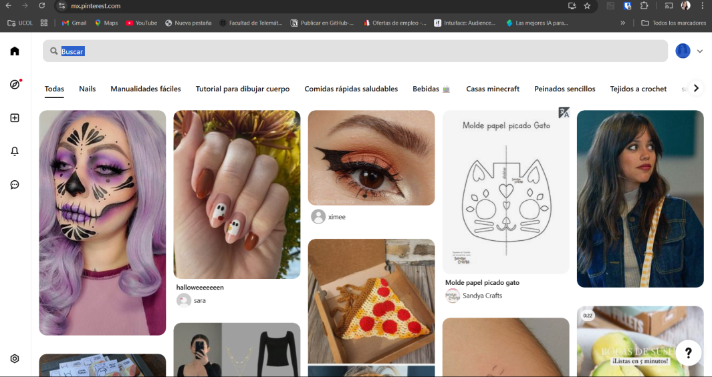

# **"Pinteres"**

Este proyecto es una réplica de la interfaz de usuario de Pinterest utilizando HTML. El objetivo es recrear la estructura visual y funcional de la plataforma, incluyendo la disposición de los elementos, los mosaicos de imágenes, y la navegación. Con este proyecto se busca profundizar en el uso de HTML para la mejorar de habilidades en frontend, imitando un diseño web moderno y atractivo.

## **AUTORES**

1. Jonatan
    - correo: jonreabarbosa@gmail.com
2. Scarlett 
    - correo: ssolorzano0@ucol.mx
3. Kaleb
    - correo: rtkaleb@gmail.com
4. Jusef
    - correo: jair.jcp@hotmail.com
5. Tony Napoles
    - correo: An631_123@hotmail.com
6. Jorge Adan
    - correo: jorgadan@icloud.com

### Repositorio
 https://github.com/rtkaleb/Proyecto-Final.git
### Github Pages
colocar link#
